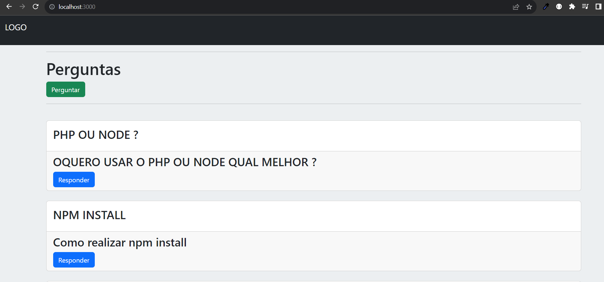
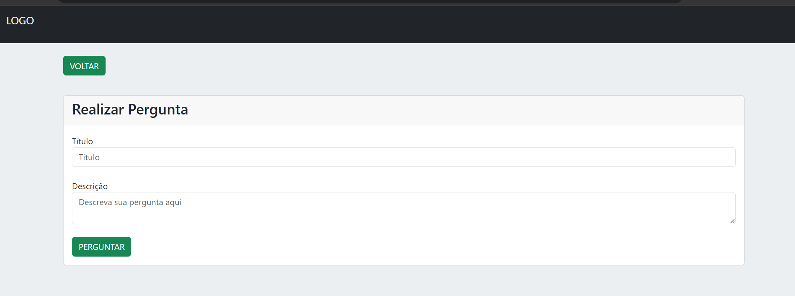
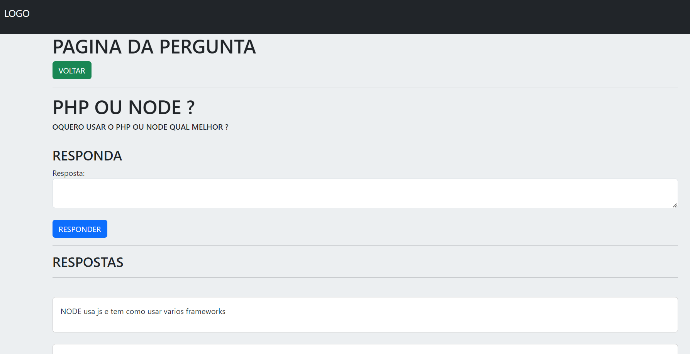

# PROJETO
Sistema de Perguntas e Respostas 

# COMO INSTALAR PROJETO 
- Clone o Projeto
- Crie um banco SQL e veja as configs em database/database.js
- Instale as dependencias através do comando npm install
- Na pasta do projeto de um comando node index para rodar o projeto

# IMAGENS DO PROJETO
## HOME

## PERGUNTAR

## RESPONDER/RESPSOTAS

# TECNOLOGIAS USADAS
- NODE
- MYSQL
- HTML/CSS/BOOTSTRAP